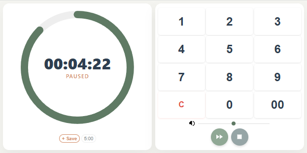

# Zen Bamboo Timer

A simple, beautiful, and fully responsive countdown timer that lives entirely in a single HTML file. It features a soothing "bamboo" chime generated by the Web Audio API, a responsive donut graph interface, and local storage presets.

## Features

*   **Visual Donut Interface:** Clean, minimalist SVG donut graph that visualizes time remaining.
*   **Responsive Design:** Automatically adjusts layout for portrait (vertical) and landscape (horizontal) orientations. The interface maintains aspect ratio and fits perfectly within the browser window.
*   **Bamboo Sound Engine:** A procedural sound using the Web Audio API that mimics a wooden bamboo block at 440Hz. No external audio files are required.
*   **Savable Presets:** Save your favorite timers (e.g., "Egg", "Pizza", "Nap") directly to your browser's LocalStorage.
*   **Interactive Controls:**
    *   **Tap:** Load a preset.
    *   **Long Press (Mobile) / Right Click (Desktop):** Delete a saved preset.
*   **Single File:** No dependencies, no build steps, no servers. Just download and open.

## Preview

> *Imagine a calming, clean interface split into two cards. On the left (or top), a large donut chart displaying the time. On the right (or bottom), a numeric keypad and playback controls. Soft muted greens and wood tones.*
>
> <figure>
  
  <figcaption>The User Interface - Available but not distracting.</figcaption>
</figure>

## Installation

1.  **Download:** Save the `zen-bamboo-timer.html` file to your computer.
2.  **Run:** Double-click the file to open it in Chrome, Firefox, Safari, or Edge.
3.  **PWA (Optional):** On mobile, use the "Add to Home Screen" option to run it as an app.

## How to Use

### Setting the Time
1.  Tap the numeric keypad to enter hours, minutes, and seconds.
    *   *Example:* `300` becomes 3 minutes 00 seconds.
2.  Press the **Green Play Button** to start the timer.

### Controls
*   **Pause:** Halts the timer.
*   **Resume:** Continues the timer.
*   **Stop:** Resets the timer to zero and clears the input.
*   **Volume:** Use the slider at the bottom to adjust the alarm volume.

### Managing Presets
*   **Save:** While the timer is stopped (IDLE) and you have a time entered, click the **+ Save** button below the donut.
*   **Load:** Tap any preset button to instantly load that time.
*   **Delete:**
    *   **Desktop:** Right-click the preset button.
    *   **Mobile:** Touch and hold the preset button for about 1 second until it turns red.

## Tech Stack

*   **HTML5** for structure.
*   **CSS3** (Flexbox, CSS Grid, Viewport Units) for responsive styling.
*   **Vanilla JavaScript** (ES6+) for logic and state management.
*   **Web Audio API** for procedural sound generation.

## License

This project is open source and available under the [MIT License](LICENSE).

## Contributing

Feel free to fork this project, customize the colors, or add new features!

---

Like what I do? [Support this project. ↗](https://shop.low.li/downloads/help-the-legend-sail-on/)

*Made with bamboo & code.*
